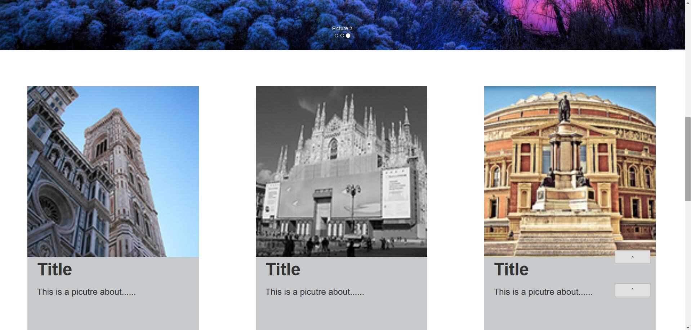
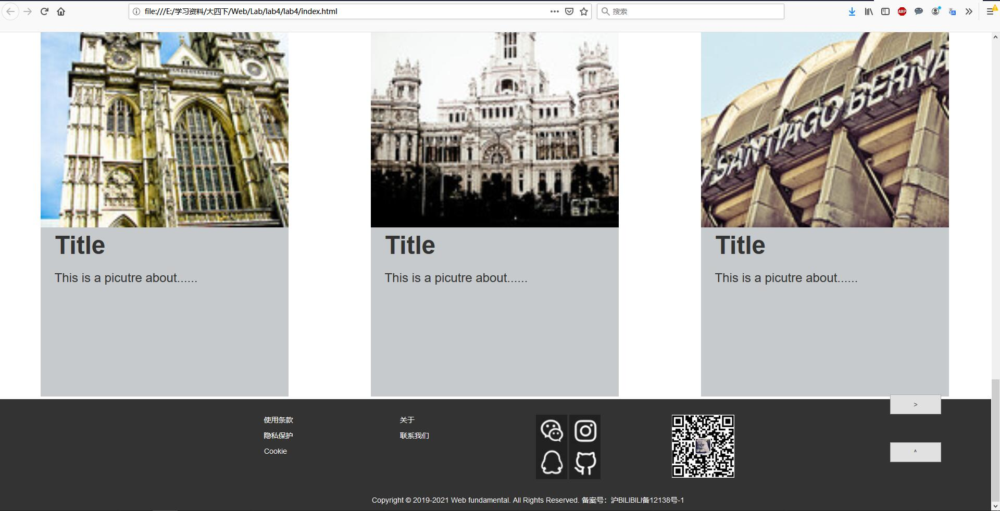

#设计文档

##设计思路

因为我喜欢github的风格，所以能不改的或者能补齐的都尽量依照原样了。

head部分是viewport视区，沿用响应式设计。

导航栏使用navbar navbar-inverse，这是非常常见的BootStrap的导航栏设计方式。同时补齐了github的logo图片。

大图片是我在网上找到的，对应img文件夹里的1.jfif到3.jfif。格式使用carousel-example-generic。这是专门用来轮播图的BootStrap格式。

六个普通图片栏，采用原有的格式，因为要配套文字，我还加了个花里胡哨的刷新功能，所以只能沿用我自己的设计，放在了css文件里。按钮的格式也是很普通的那种。

尾部同样沿用样例的github风格，补齐了所有的图标（wechat ins qq github），换上了我自己的微信二维码。container也是一种响应式设计，同时起到了容器的作用。

##具体功能

保留了导航栏的高亮、跳转、二级标题功能。

保留了主图片的轮播功能，修改了文字介绍。

刷新按钮可以在两组图片中相互切换（使用JS），返回按钮可以回到顶部（使用JS），两个按钮的图标容易认出，位于屏幕右下角。

##效果图

