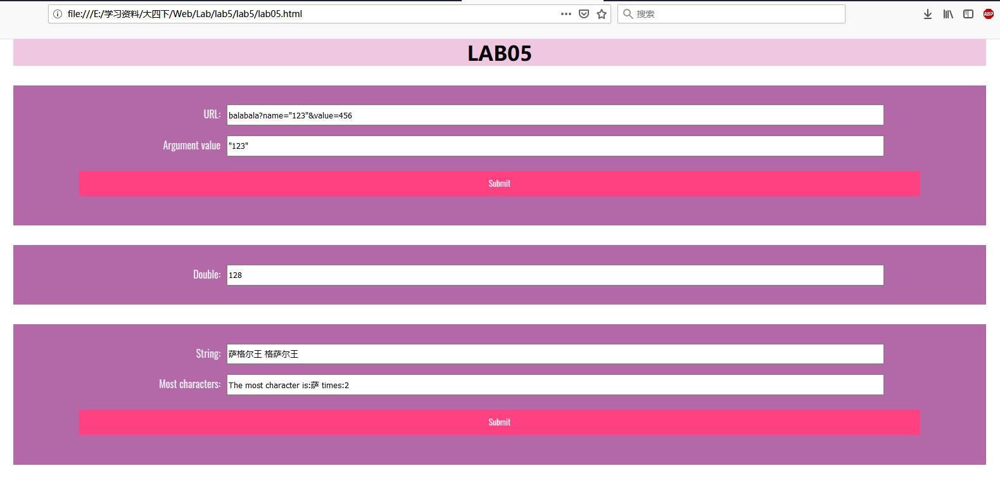
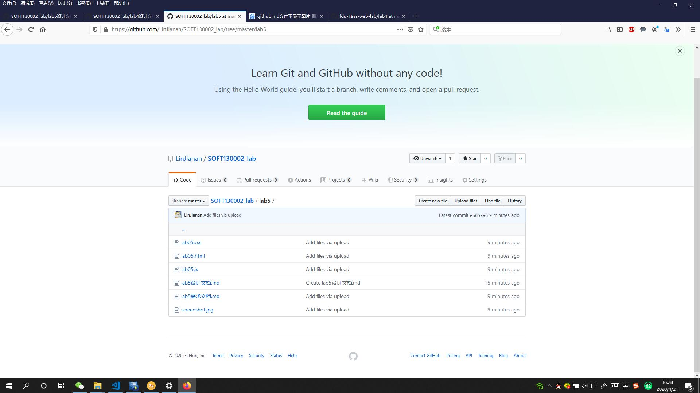

## 三个函数的完成方式

### 1. showWindowHref()

默认 url_result.value 为 "No Parameter Name"，这是检测不到的时候的显示。然后进行字符串切割，第一次根据 "?" 切割，第二次根据 "&" 切割，然后对第二次的每一个分块检测 "=" 左边是否为name，若是，则 url_result.value 为 "=" 右边的内容。

### 2. timeTest()

设置初始值和相关参数（详见代码注释，如周期 5s，最多 10 次，检测当前分钟与此前是否一致等等），用 setTimeout() 函数保证按照周期自动运行，函数内部设置检测条件，若已经 10 次或到达下一分钟则停止，否则递归调用本函数。

### 3. arrSameStr()

用了字典，因为跟 python 很像就直接用了，逐个统计每一个 char 的频率，最后顺序寻找最大值，再输出。

## 截图

我讨厌套娃......

以及不要问我为啥看不到图片，这bug我解决不了，我只能说蓝字点进去有效，气哭......
