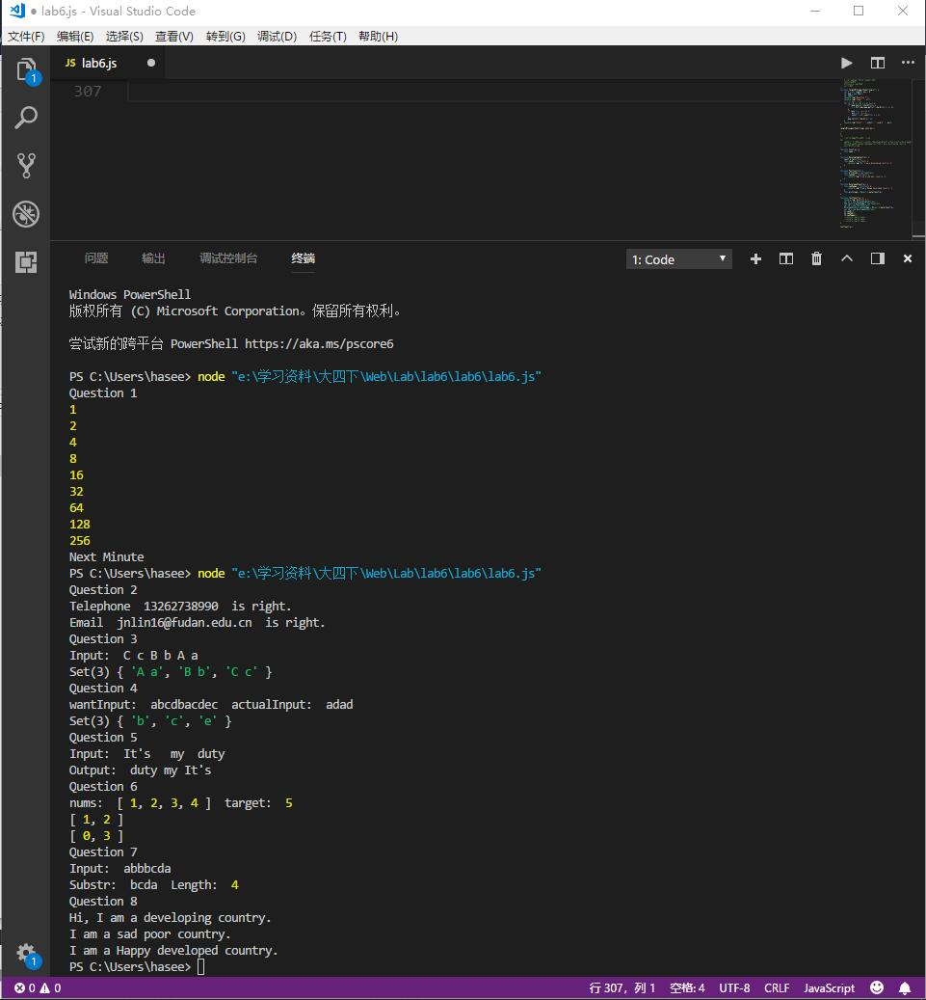

## 正则表达式

1.邮箱：/^([a-zA-Z]|[0-9])(\w|\-)+@([a-zA-Z0-9]|\.)+\.([a-zA-Z]{2,4})$/
规则
1.第一位为数字或字母，中间为多个数字、字母、“_”、“-”
2.接着是 @ 符号，后面是数字、字母和“.”
3.然后是最后一个“.”加 2-4 个字母结尾

2.重复：/\b([a-z]+) \1\b/ig
\b是匹配一个单词的边界
([a-z]+) 是匹配一个到多个小写字母
\1是引用第一个括号的内容
/ig 不区分大小写，并且全局搜索

## 不同继承

1.原型链继承：让新实例的原型等于父类的实例。实例可继承的属性有：实例的构造函数的属性，父类构造函数属性，父类原型的属性。（新实例不会继承父类实例的属性）

2.构造函数继承：用.call()和.apply()将父类构造函数引入子类函数（在子类函数中做了父类函数的自执行（复制））

3.Object.create()：Object.create()方法创建一个新对象，使用现有的对象来提供新创建的对象的__proto__。返回一个新对象，带着指定的原型对象和属性。

## Map、Set、Array

1.Array是一个数组，内存连续，在不改变长度的前提下适用。

2.Set是一个集合，顺序与Array一致（这与Python不同），可扩充删除，充当链表。

3.Map是一个映射，与Java的HashMap一致，适合用空间复杂度换取时间复杂度，因为哈希映射的复杂度为O(1)，而其他两个都是O(N)。

## 运行截图

